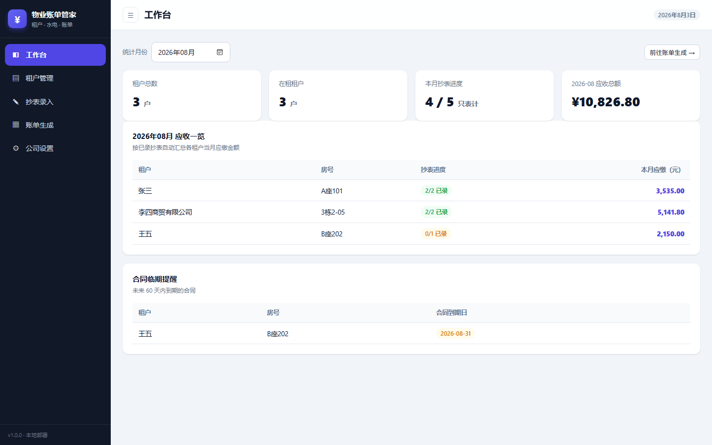
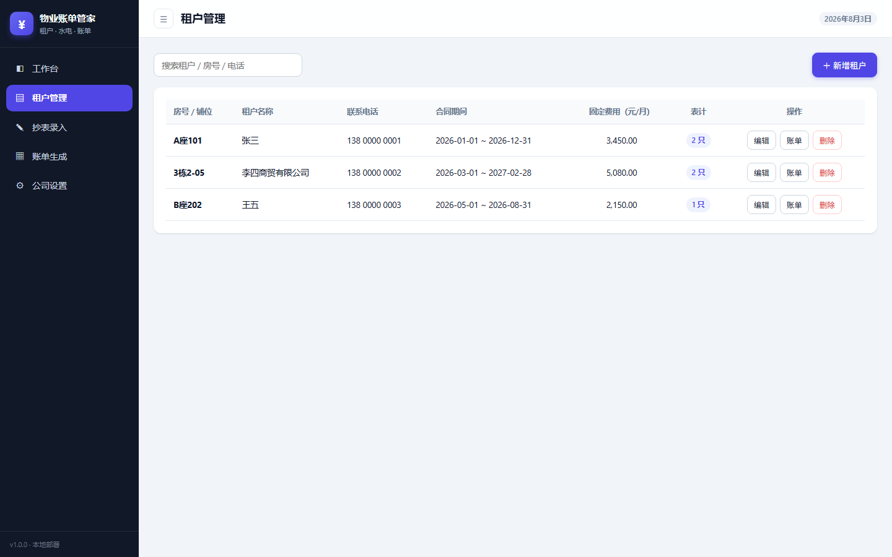
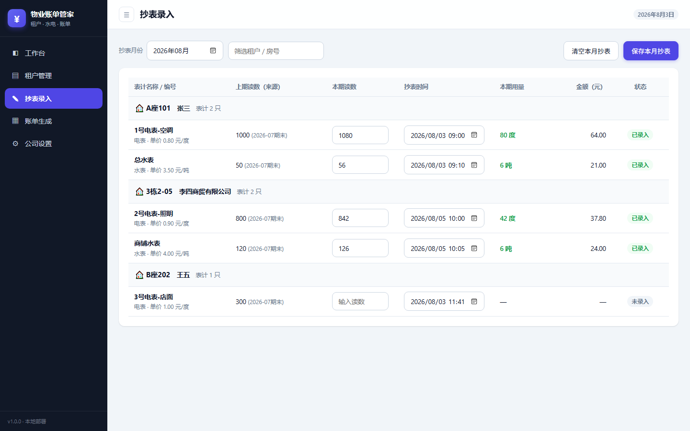
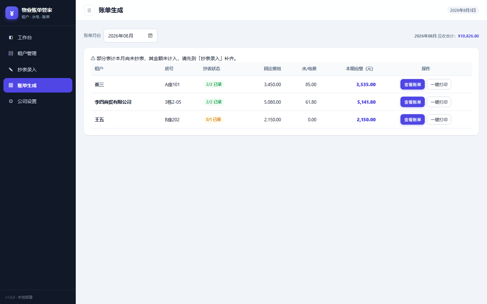
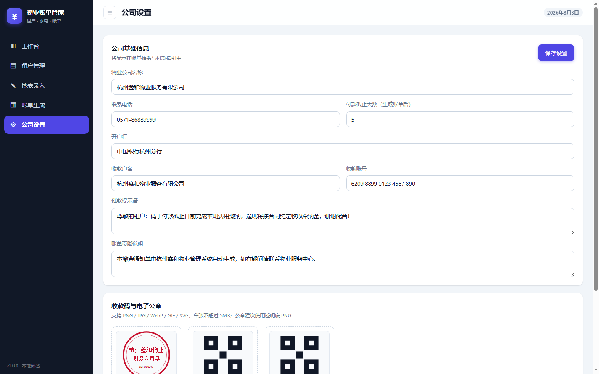
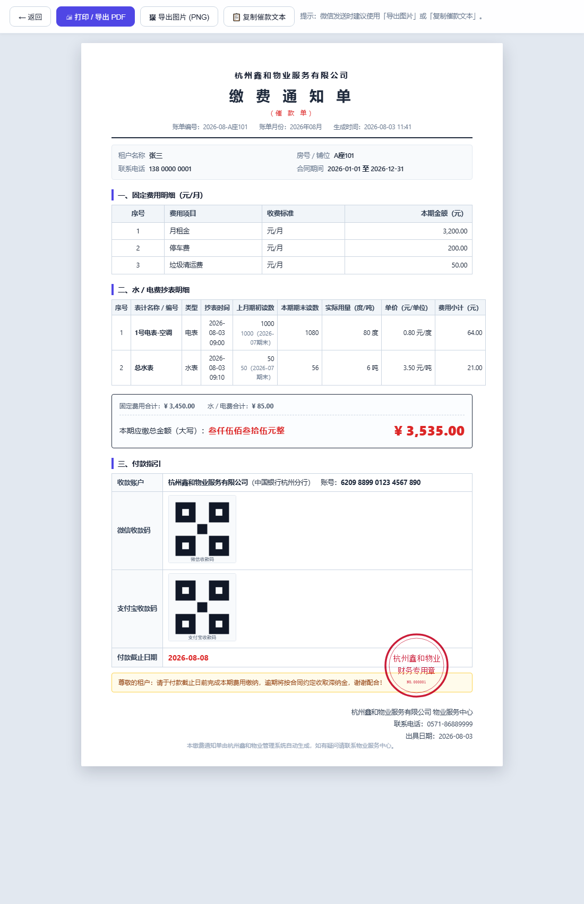
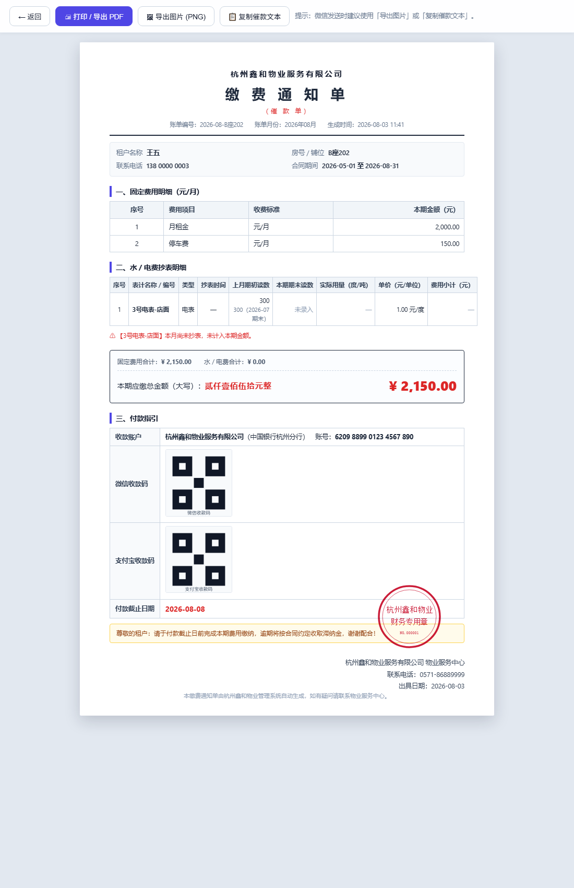

<p align="center">
  <a href="README.md">中文</a> | <b>English</b>
</p>

<p align="center">
  
</p>

<h1 align="center">Property Billing System · 物业账单管家</h1>

<p align="center">
  <strong>A lightweight billing & collection system for property management companies</strong><br>
  Multi-meter meter readings · automatic previous-reading tracking · one-click payment demand notes with e-seal · print / PDF / image export
</p>

<p align="center">
  
  
  
  
</p>

---

> Runs with just Node.js installed — **no `npm install`, no build step, zero third-party dependencies**. Data is stored in local JSON files; copying the directory is all you need for backup. Ideal for residential communities, commercial complexes/parks, and sub-landlords who need monthly invoices / payment reminders.

## ✨ Features

- 🧾 **One bill, all fees** — monthly rent + parking + waste disposal + all water/electricity meter charges, generated with one click
- 💧 **Multiple meters per tenant** — bind any number of water and electricity meters per tenant, each with its own unit price
- 🔁 **Automatic reading tracking** — the previous month's reading is fetched automatically to compute `usage = current − previous`; abnormal readings are flagged
- 📥 **One-click Excel import** — download the template, fill in the data, and import tenants, meters and readings directly; legacy "电费 / 水费" wide-format sheets are also supported
- 🏛️ **E-seal + payment QR codes** — the company e-seal is overlaid on the bill, WeChat / Alipay QR codes appear in the payment instructions
- 💴 **RMB amount in Chinese uppercase** — bills show the formal amount in words (e.g. 叁仟贰佰壹拾元整), professional and compliant
- 📤 **Three output methods** — browser print / save as PDF, export PNG image (great for sending via WeChat), copy plain-text collection message
- 📱 **Responsive UI** — hand-written Tailwind-style CSS, works on desktop and mobile
- 🐳 **One-command deployment** — Docker, 宝塔 / cloud servers (Alibaba Cloud, Tencent Cloud), PM2
- 💾 **Zero dependencies + file persistence** — all data in three JSON files, minimal maintenance cost

## 📸 Screenshots

| Dashboard | Tenants | Meter Reading Entry |
| --- | --- | --- |
|  |  |  |

| Bill List | Company Settings | Full Bill (with e-seal) |
| --- | --- | --- |
|  |  |  |

> Unrecorded meters are clearly marked and excluded from the bill: 

## 🚀 Quick Start

### Windows

Double-click `start.bat`, or run:

```bash
node server.js
```

Open <http://localhost:3000> in your browser.

### Docker

```bash
docker compose up -d
```

Or build and run manually:

```bash
docker build -t property-billing .
docker run -d -p 3000:3000 -v $(pwd)/data:/app/data --name property-billing property-billing
```

Data is persisted through the `data/` volume; upgrading the image does not affect your bills.

### 宝塔 Panel / Cloud Server (Alibaba Cloud, Tencent Cloud, etc.)

1. Upload the project directory to your server (e.g. `/opt/property-billing`)
2. Install Node.js (>= 18)
3. Keep it running with PM2: `pm2 start server.js --name property-billing`
4. In 宝塔 "Websites", create a reverse proxy to `http://127.0.0.1:3000` and bind your domain
5. Enable HTTPS for the site

## 🧩 Features in Detail

### 1. Company Configuration

- Company name, phone, bank account details (account holder / bank / account number)
- WeChat and Alipay payment QR code upload (shown in the payment instructions section)
- Company e-seal upload (transparent PNG recommended), automatically overlaid at the bottom-right of the bill
- Payment due days, collection message and footer note are all customizable

### 2. Tenant Management (CRUD)

- Tenant name / company name, location / room / unit number, phone, contract start & end dates
- Per-tenant fixed fees: monthly rent, parking fee, waste disposal fee (CNY/month)
- Bind **multiple water meters + multiple electricity meters** per tenant, each with its own name and unit price (CNY/kWh, CNY/ton)
- Dashboard alerts for contracts expiring within 60 days

### 3. Monthly Meter Readings & Tracking

- Enter readings and reading times for all meters per month, in bulk or individually
- The previous reading is fetched automatically: `usage = current − previous`, `meter fee = usage × unit price`
- First reading starts from 0 and is clearly labeled; readings lower than the previous month are flagged as abnormal
- Monthly readings can be cleared and re-entered

### 4. Bill Generation & Payment Demand Note

Pick a month and generate a bill that aggregates all fees for the tenant (rent + parking + waste + all meter charges), containing:

1. **Header**: company name, bill number, billing month, generation time
2. **Tenant info**: name, location / room, phone, contract period
3. **Fixed fees table**: item, rate, amount for the period
4. **Water / electricity meter detail table** (one row per meter): meter name, type, reading time, previous reading (with source month), current reading, actual usage, unit price, fee subtotal
5. **Summary**: total due (RMB in Chinese uppercase + numerals), fixed fees subtotal, meter fees subtotal
6. **Payment instructions**: bank account, WeChat / Alipay QR codes, due date, collection message
7. **Signature area**: company e-seal (overlaid image), phone number

**Output**: one-click print / save as PDF, export PNG image (great for WeChat), or copy a plain-text collection message.

### 5. Excel Data Import

For property companies that already manage records in Excel, this provides a "download template → fill in data → one-click import" flow — no manual entry needed:

1. **Download the template** from the "Excel 导入" page: `数据导入模板.xlsx`, with four worksheets:
   - `公司设置` (Company Settings): name, phone, bank, account, due days, messages
   - `租户信息` (Tenants): name, location/room, phone, contract dates, rent, parking, waste fee
   - `表计配置` (Meters): tenant, meter name, type (electricity/water), unit price
   - `抄表数据` (Readings): tenant, meter, month (YYYY-MM), current reading, reading time
2. **Import modes**: **Merge** (upsert by name; readings overwritten per meter+month; re-importing is idempotent) or **Replace** (delete all existing tenants and readings first).
3. **Legacy sheets supported**: upload old "电费 / 水费" wide-format files directly (name / rate / initial reading / per-month columns); meters are split automatically by year and tenant.

Monthly bills are available immediately after import, with amounts identical to manual entry.

## 🛠 Tech Stack

**Zero-dependency Node.js + vanilla responsive frontend + JSON file persistence** — deliberately no npm dependencies and no build step:

- No `npm install`, no compilation; just install Node.js and run. Minimal maintenance cost
- Data lives in three JSON files under `data/`; backup = copy the directory
- Hand-written responsive CSS (Tailwind-like), usable on desktop and mobile
- Bill image export uses the browser's native SVG → Canvas pipeline, no third-party libraries
- To migrate to MySQL / PostgreSQL, only replace the storage layer and `saveJson` calls in `server.js`

## ⚙️ Configuration & Data

| Env var | Description | Default |
| --- | --- | --- |
| `PORT` | Server port | `3000` |
| `HOST` | Bind address | `0.0.0.0` |
| `DATA_DIR` | Data directory (for Docker mounts) | `./data` |

Files under `data/`:

- `settings.json` — company info, payment QR codes, e-seal
- `tenants.json` — tenants and meter configuration
- `readings.json` — all meter readings (meter name / price snapshotted per record, so historical bills are unaffected by later price changes)

**Backup**: stop the service and copy the `data/` directory; restore by putting it back in place.

## 🔌 Main API

| Method | Path | Description |
| --- | --- | --- |
| GET | `/api/health` | Health check |
| GET | `/api/months` | List of months with data (including current month) |
| GET / PUT | `/api/settings` | Get / update company settings (QR codes, e-seal) |
| GET / POST | `/api/tenants` | List / create tenants |
| GET / PUT / DELETE | `/api/tenants/:id` | Tenant detail / update / delete (cascades readings) |
| GET | `/api/readings?month=YYYY-MM` | Full reading data for a month (with previous readings) |
| POST | `/api/readings/batch` | Save readings in batch |
| DELETE | `/api/readings?month=YYYY-MM` | Clear readings for a month |
| GET | `/api/bill?tenantId=&month=` | Full bill data for one tenant |
| GET | `/api/bills/summary?month=` | Monthly summary for all tenants |
| GET | `/api/dashboard?month=` | Dashboard statistics |
| GET | `/api/import/template` | Download the Excel import template |
| POST | `/api/import?mode=merge\|replace&year=` | Upload XLSX and import (official template or legacy 电费/水费 sheets) |

## 📁 Project Structure

```text
property-billing-system/
├── server.js          # Zero-dependency HTTP server (API + static files)
├── lib/               # xlsx read/write & Excel import logic (zero dependencies)
├── public/            # Frontend
│   ├── index.html     # Admin UI (dashboard / tenants / readings / bills / import)
│   ├── bill.html      # A4 bill / payment demand note (print, PDF, image export)
│   ├── css/style.css
│   └── js/            # app.js (admin logic), util.js (RMB amount, etc.)
├── data/              # Runtime data files (backup this directory)
├── previews/          # Screenshots
├── Dockerfile         # One-command container deployment
├── docker-compose.yml
└── start.bat          # Windows one-click start
```

## 🔒 Security Notes

This system is designed as an **internal tool** for property companies and **does not include login authentication by default**. When exposing it to the public internet, be sure to:

- Add Basic Auth or IP allow-listing via 宝塔 / Nginx reverse proxy
- Enable HTTPS
- Or keep it on the internal network only (`HOST=127.0.0.1` makes it local-only)

## 🗺 Roadmap

- [ ] Multi-company / multi-ledger support
- [ ] Bill history archiving and per-tenant queries
- [ ] WeChat / SMS automatic bill delivery
- [ ] Export receivable details to Excel
- [ ] Pluggable database storage (MySQL / PostgreSQL)

## ☕ Support

If this project helps you, feel free to [buy me a coffee](SPONSOR.md) ☕ Every bit of support keeps maintenance and development going.

## 📄 License

Open-sourced under the [MIT License](LICENSE).
